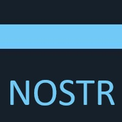

## Hi there👋, my name is Lucas Chabra

Driven by a passion for technology, I embrace AI to enhance my projects, ranging from hardware tinkering to software development.

## 🖥️ Languages, Skills, Tools

- **TypeScript / React / C#**: Full-stack web app development. Learning projects: [AmySurf](https://github.com/lchabra/AmySurf) & [EatWhat](https://github.com/lchabra/EatWhat).
- **Docker / Linux**: Experience using it to containerize a stack deployed on a Linux SBC, including:

  - **[AmySurf](https://github.com/lchabra/AmySurf)**: Built and hosted Web App.
  - **[Bitcoin node](https://github.com/bitcoin/bitcoin)**: Set up and managed a Bitcoin node.
  - **[LND node](https://github.com/lightningnetwork/lnd)**: Configured and maintained an LND node.
  - **[Nbxplorer](https://hub.docker.com/r/nicolasdorier/nbxplorer/)**: Minimalist UTXO tracker.
  - **[Tor](https://www.torproject.org/)**: Integrated Tor.
  - **[Nostr](https://github.com/fiatjaf/nostr)**: Deployed Nostr for decentralized social networking on **[AmySurf](https://github.com/lchabra/AmySurf)** and **[EatWhat](https://github.com/lchabra/EatWhat)**.
  - **[Grafana](https://grafana.com/), [Prometheus](https://prometheus.io/)**: Monitoring system metrics.
  - **[Traefik](https://traefik.io/)**: Implemented Traefik as a reverse proxy and load balancer for managing microservices.
  - **[Photoprism](https://github.com/photoprism/photoprism)**: Self-hosted photo management.
  - **...and more**: Continuously exploring and integrating new technologies.

- **Git**: Version control for my projects.
- **Udemy**: Completed [course](https://www.udemy.com/course/react-the-complete-guide-incl-redux/) on React, Hooks, Redux, React Router, Next.js.

- and more...

## 🚀 Projects

- **[AmySurf](https://github.com/lchabra/AmySurf)** & **[EatWhat](https://github.com/lchabra/EatWhat)**: Personal projects for learning full-stack web development (TypeScript, React, C#).
- **[Other Projects](https://github.com/lchabra?tab=repositories)**: Mainly working on my private stack.  
  Check out my repositories for additional projects showcasing my skills in React, TypeScript, and beyond.

## 📫 How to reach me

